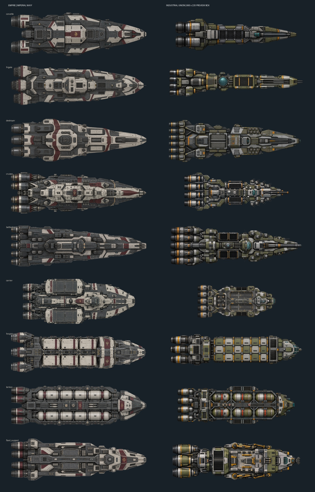

# Empire production sprite refresh

## Scope and comparison

User-requested replacement of all nine M22.3 Imperial ship bases, with Industrial Union
production art as the quality benchmark. This is an art maintenance change, not M22.6 closure.
Canonical source: `docs/factions/empire_visual_bible.md` and the attached v0.1 visual code.

The old Imperial corvette was a flat schematic with a few armor polygons. The Union pack
already offered fine service seams, material texture, readable engines and class-specific
industrial equipment. The refreshed Imperial fleet now uses detailed maintained armor,
central citadels, burgundy identification panels, restrained brass and visible engineering.
Union geometry was not reused: a trial generation that copied its block-spine was rejected.

This sheet compares visual detail in equal preview boxes, **not physical ship scale**.
Manual review covered all nine roles, alpha edges on a dark background and the final cruiser
at native resolution. The Union uses stronger outlined module separation; Imperial surfaces
are more continuous and armored. Quality parity is an artistic review judgment, not a claim
that color count or PNG file size proves quality.

| Criterion | Empire refresh | Existing Union |
|---|---|---|
| Canvas | 768 x 512 RGBA | 768 x 512 RGBA |
| Visible length | 660 px | approximately 648–660 px |
| Main identity | continuous armor / central citadel | standardized exposed industrial blocks |
| Military roles | compact corvette, sensor frigate, missile destroyer, cruiser, heavy battleship, enclosed carrier | distinct corresponding role silhouettes |
| Logistics roles | containers, framed tank banks, stowed repair equipment | containers, modular tanks, industrial manipulators |
| Detail | panel joints, hatches, piping, repaired wear, engines | panel joints, hatches, piping, wear, engines |
| Base PNG size | 208–319 kB | approximately 140–357 kB |
| Additional layers | nine rebuilt emissive + nine damage overlays | existing base-only pack |

Exact per-family measurements are in `assets/empire_refresh/metrics.json`.

## Preparation and integration

Nine separate images were generated with the built-in image tool. The user explicitly
authorized programmatic background extraction and layer preparation. RGB sources had only
border-connected near-white backgrounds removed. Existing alpha sources retained their
ship component; one source pixel of matte fringe and disconnected specks were removed.
Each cropped source was normalized to the existing engineering hull L/W and centered on
768 x 512. Final layers use existing catalog resource paths, facing RIGHT and centered pivot.

Emissive pixels are extracted from actual cyan instruments inside the new base. Damage is
a deterministic, family-seeded set of local scars and scratches, clipped inside the hull.
These are generic presentation damage masks, not physical per-compartment damage evidence.
Shared engine effects, engineering data, fit IDs and hardpoint coordinates are preserved.
Painted hardware is visual detail; it does not define fitted modules or new combat capability.
Exact per-hardpoint animated equipment art remains outside this base-texture replacement.

The existing `Stage22EmpireShipVisualCatalog` resolves all replaced paths. This change does
not introduce new viewer routing; viewers that still use generic Stage-20 art retain their
existing selection behavior. A running desktop campaign was not visually tested here.

Reproducible preparation entry point: `tools/art/prepare_empire_sprites.py` (Pillow, numpy,
scipy). Without arguments it rebuilds overlays and comparison sheets from committed bases;
an optional JSON family-to-source-path mapping also rebuilds normalized bases. Accepted
production PNGs and generation briefs are committed; rejected generation trials are excluded.

## Verification

- Direct image checks passed for all nine families: RGBA, bounded occupancy, consistent layer
  dimensions, nonempty overlays, no emissive/damage pixels outside base alpha.
- Existing Java catalog/layer tests remain intact. A regression test adds 768 x 512, safe
  margins, centered bounds, engineering aspect and a detail floor to reject schematic art.
- Local Maven could not resolve JaCoCo from Maven Central (DNS failure), before tests ran.
- Required GitHub CI must pass for the exact PR head before merge. No Stage-22 status is
  promoted by this asset change.
