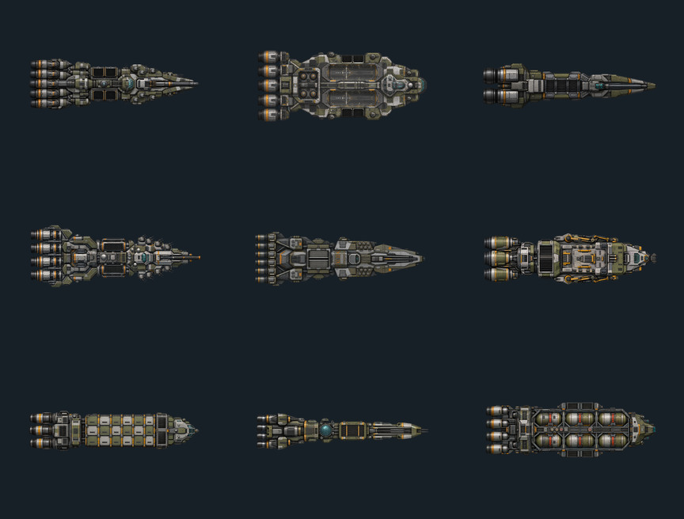

# M22.4 Industrial Union production sprite audit

## 1. Purpose and authority

This audit replaces the nine temporary Industrial Union production sprites with role-readable,
production-grade base art. The accepted authority chain is:

1. `docs/factions/industrial_union_visual_bible.md` for faction language, palette and exclusions;
2. the authored M22.4 engineering hull dimensions and primary-fit module roles for silhouette intent;
3. the Stage-20 runtime convention: orthographic top-down sprite, transparent PNG, forward/right facing;
4. presentation-only ownership: art does not define physics, hardpoints, fit legality or simulation state.

The work deliberately does not copy the Empire's hierarchy/citadel language. Industrial Union ships
communicate a mature industrial power through standardized blocks, repeatable sections, accessible
service paths, visible logistics and restrained wear.

## 2. Baseline finding

All nine previous files were schematic placeholders rather than production art:

- fixed `256x256` canvases;
- exactly nine colors per sprite;
- only about `1.4-1.8 KiB` per file;
- nose-up orientation, inconsistent with the runtime's forward/right convention;
- flat geometric fills with no material, panel, service or wear detail;
- weak distinction between military, logistics and support roles.

Already detailed Stage-20.5 and heavy-corvette assets were inspected as quality references and left
unchanged. This change is limited to the acute M22.4 Industrial Union placeholder set.

## 3. Generation contract

The common generation brief used for every ship was:

> Orthographic top-down 2D production game sprite of one Industrial Union spacecraft, isolated on a
> genuinely transparent background. Nose points exactly right and engines sit at left. Use a mature,
> standardized industrial design: graphite and mill steel structure, machine slate and workshop-olive
> panels, assembly-grey service surfaces, restrained oxide-ochre and safety-amber markings, small
> instrument-teal accents, dense readable panel seams, fasteners, access hatches, conduits and realistic
> restrained wear. Preserve a strong silhouette at gameplay scale. No scene, stars, floor, border,
> labels, baked shadow, glow, exhaust or deployed effects; no retro-Soviet caricature, scrapyard look,
> Imperial central citadel, fantasy ornament or painterly background.

Each family was generated separately so role geometry could not collapse into a recolored master hull:

| Family | Authored role delta |
|---|---|
| Corvette | Compact 2-3-module escort; one large kinetic cassette, common reactor/drive/sensor/radiator |
| Frigate | Longer escort with a dominant central mission/sensor block and one kinetic cassette |
| Destroyer | Forward-heavy combat block with clearly separated weapon and defensive cassettes |
| Cruiser | Repeated independent mission sections and redundant service access |
| Battleship | Massive but standardized repeated combat systems rather than a singular citadel |
| Carrier | Broad hangar/service blocks, protected launch lanes and defensive cassette |
| Freight | Exposed central load spine with repeated standardized cargo modules |
| Tanker | Repeated cylindrical tank modules enclosed by a protective service frame |
| Fleet support | Mobile workshop/repair/replenishment hull with stowed cranes and docking equipment |

Rejected generations included baked checkerboards, overly broad corvette/frigate silhouettes and a
support hull with cranes deployed outside a safe gameplay silhouette. Only corrected outputs entered
the production tree.

## 4. Normalized accepted assets

Every accepted source was alpha-trimmed, Lanczos-scaled inside a common `660x410` safe area and centered
on a transparent `768x512` canvas. No opaque pixels or effects were added outside the generated hull.

The dark field belongs only to this review contact sheet; the production files remain transparent.
Rows, left to right: battleship, carrier, corvette; cruiser, destroyer, fleet support; freight, frigate,
tanker.

| Family | Canvas | Visible bounds | Colors | PNG bytes | Physical L/W | Sprite W/H |
|---|---:|---:|---:|---:|---:|---:|
| Battleship | 768x512 | 648x217 | 43,418 | 235,322 | 2.84 | 2.99 |
| Carrier | 768x512 | 653x369 | 56,355 | 356,864 | 2.38 | 1.77 |
| Corvette | 768x512 | 659x244 | 29,114 | 161,781 | 2.76 | 2.70 |
| Cruiser | 768x512 | 649x279 | 49,180 | 263,847 | 2.87 | 2.33 |
| Destroyer | 768x512 | 660x218 | 39,657 | 227,044 | 2.88 | 3.03 |
| Fleet support | 768x512 | 660x231 | 53,262 | 250,210 | 2.83 | 2.86 |
| Freight | 768x512 | 650x196 | 41,734 | 201,056 | 3.00 | 3.32 |
| Frigate | 768x512 | 655x184 | 32,898 | 140,666 | 3.08 | 3.56 |
| Tanker | 768x512 | 650x248 | 65,642 | 288,732 | 3.05 | 2.62 |

The carrier's hangar breadth and the cruiser's repeated lateral mission sections intentionally consume
more width than a pure bounding-box projection. All silhouettes remain within a 30% presentation
tolerance of the authored physical length/width ratio.

## 5. Regression gate and boundary

`Stage22IndustrialUnionProductionSpriteTest` enforces:

- the exact nine catalog-bound production paths;
- unique file content and a `100 KiB` minimum detail floor;
- `768x512` alpha canvases with fully transparent corners;
- bounded occupancy, visible color/detail floor and centered safe-area placement;
- distinct physical-aspect expectations for all nine authored hulls.

M22.4 continues to bind a family's primary and refit fits to the same reviewed base silhouette. Damage,
emissive and engine-state overlays are not fabricated by this art replacement and remain later visual
polish work unless a later milestone assigns their runtime authority explicitly.
